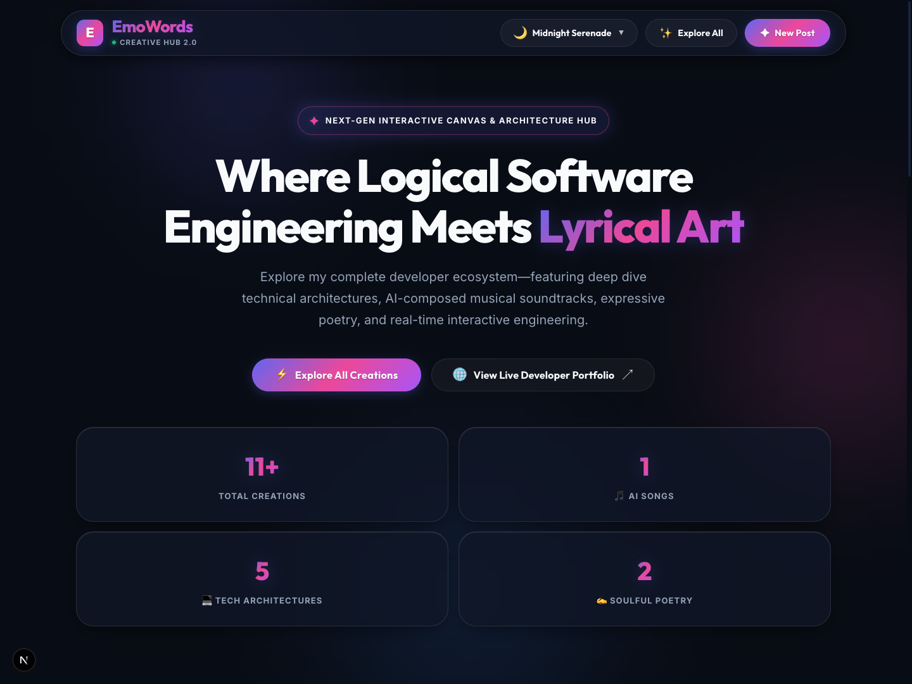
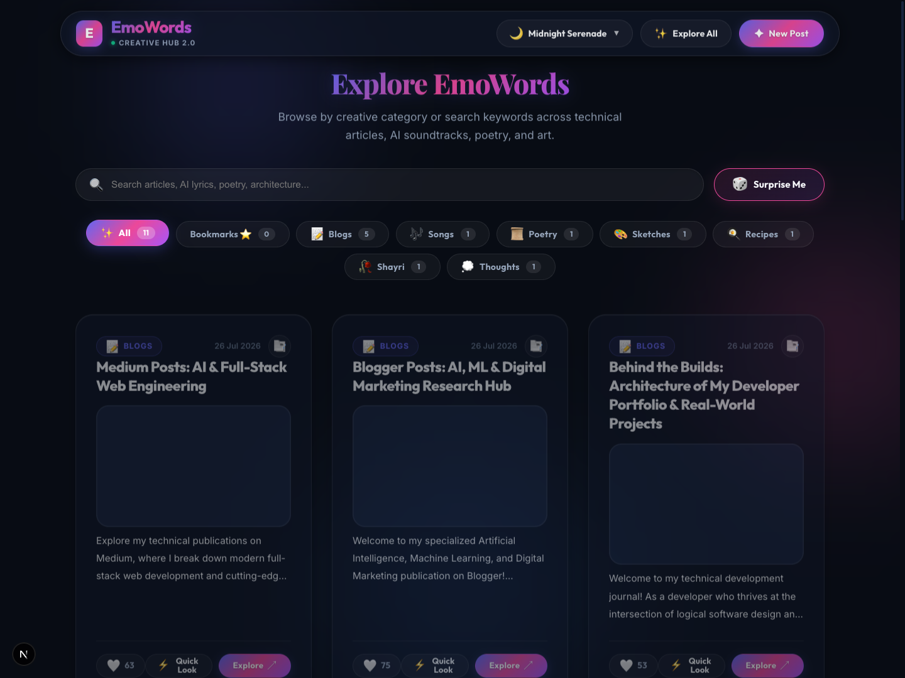
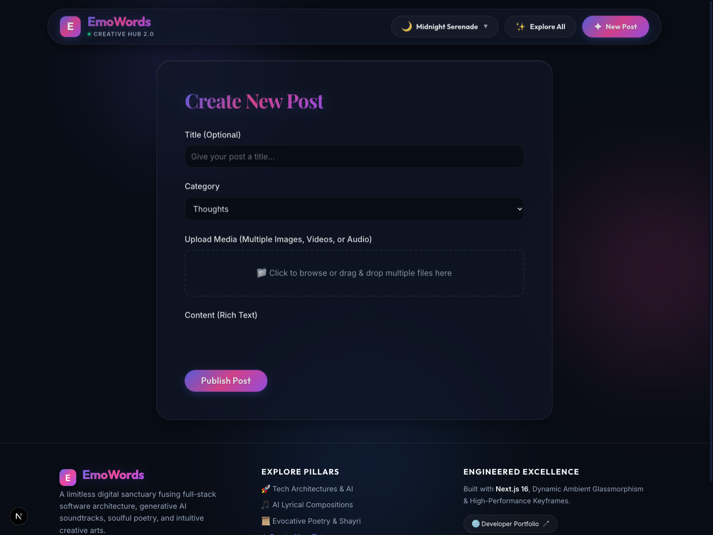

# 🌟 EmoWords (Invest In Myself)
*Where Logical Software Architecture Meets Imaginative Human Creativity and Generative AI*


---

## 📸 Website Preview & Screenshots

### 🏠 Interactive Home Feed & Showcase
Experience an immersive digital canvas presenting technical deep-dives, introspective human poetry, art showcases, and developer portfolio highlights.


---

### 🔍 Explore & Discovery Hub
Filter, discover, and search across specialized categories including Blogs, Songs, AI Music Fusions, and Software Architecture studies.


---

### ✍️ Creator Studio & Instant Upload Engine
An integrated rich-text publishing suite powered by client-side HTML5 Canvas media compression, empowering creators to share without technical limits.


---

## 🚀 About the Project
**EmoWords** is an advanced interactive web application and creative engineering platform designed to bridge the gap between logical full-stack software development, artistic human expressions, and modern artificial intelligence architectures.

Every feature centers on resilient, high-performance web engineering while delivering delightful, emotionally resonant user experiences.

---

## ⚡ Core Features & Technical Innovations

### 1. 🎵 AI-Assisted Music Convergence & Interactive Player
* **Human-in-the-Loop Lyricism:** Raw, authentic poetry is composed directly by human emotion, providing the soul of every soundtrack.
* **Algorithmic Soundscapes:** Generative acoustic models synthesize custom melodies (ambient lo-fi, acoustic folk, synthwave) tailored to lyrical cadences.
* **Built-in Audio Player:** Integrated soundtrack controls let visitors listen to musical arrangements while simultaneously reading written poetry.

### 2. 🛡️ Client-Side Canvas Image Optimization Engine
* **Zero-Friction Compression:** Solves strict serverless HTTP payload constraints (such as Vercel/AWS Lambda 4.5 MB POST limits) without external object storage overhead.
* **In-Browser Interception:** Automatically intercepts images >1MB before network transmission.
* **HTML5 Canvas Scaling & Reserialization:** Generates an in-memory 2D Canvas, caps resolution at 2K (2560px), and encodes to an 85%-quality JPEG Blob—transforming raw 11MB pictures into ~400KB payloads in under 200 milliseconds.

### 3. ✍️ Next-Generation Content Studio
* **Rich Text Editing:** Integrated with `react-quill-new` for dynamic formatting and expressive documentation.
* **Robust API Routes:** Custom built Next.js file upload and metadata processing API endpoints.

---

## 🛠️ Technology Stack

* **Framework:** [Next.js 16.2+](https://nextjs.org/) (App Router & Serverless API Routes, Turbopack)
* **UI & Component Architecture:** [React 19](https://react.dev/)
* **Design System & Styling:** Modern Vanilla CSS (Tailored HSL dark/light palettes, responsive glassmorphic accents, micro-animations)
* **Editor Integration:** `react-quill-new`
* **Media Processing:** Native HTML5 Canvas 2D Rendering Engine & Web API Blobs
* **Deployment & Edge Optimization:** Vercel & Node.js Serverless Functions

---

## 🏁 Getting Started

### 1. Clone the Repository
```bash
git clone https://github.com/shikhu51197/Invest_In_Myself.git
cd Invest_In_Myself
```

### 2. Install Dependencies
```bash
npm install
```

### 3. Start the Development Server
```bash
npm run dev
```

Open [http://localhost:3000](http://localhost:3000) (or the active port displayed in your terminal) in your browser to experience the platform locally!

---

## 🌐 Author & Connect
* **Developer:** Shikha Gupta
* **Live Digital Portfolio:** [https://shikhu51197.github.io/](https://shikhu51197.github.io/)
* **GitHub Repository:** [https://github.com/shikhu51197/Invest_In_Myself](https://github.com/shikhu51197/Invest_In_Myself)

---
*Built with passion, logical engineering, and imaginative art.* 🎨💻
